# This repository shows my understanding and usage of cloud tools, platform, and services. It fulfills the Work Processes:

  > - Use various cloud tools, services, and platforms
  > - Use logging and monitoring tools
  > - Migrate data from on-premise solution to cloud solution

## About

The app contained in this repository is a fibonacci calculator. You enter an integer and receive the n'th value in the fibonacci sequence. i.e: 11 -> 144. Once a value has been entered, it is saved in a postgres db and a redis cache is used so that computation doesn't have to be done again.

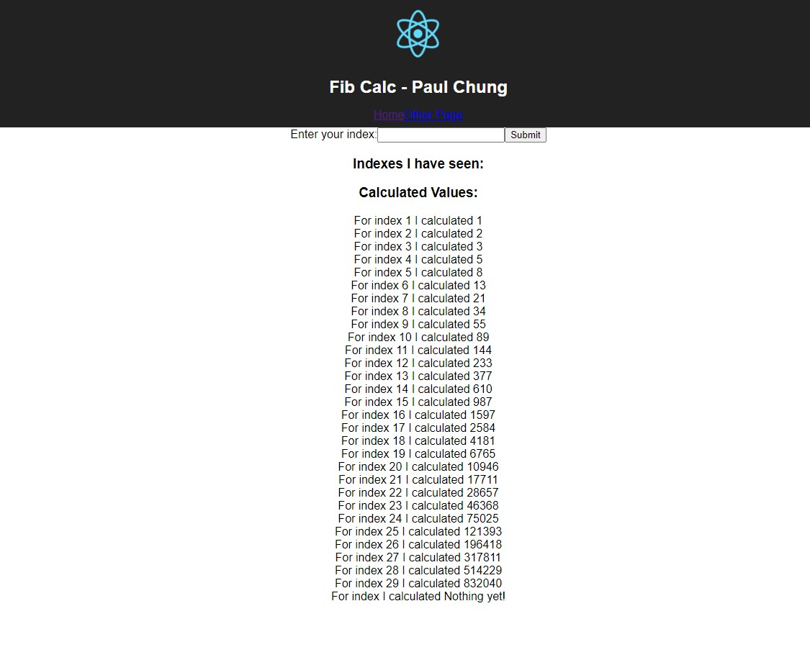

This repo contains 4 folders which are used to create 4 docker images:

- client - web application
- nginx - traffic manager
- server - server
- worker - connects server to postgres

I have built the four images and have pushed them to my dockerhub repository:

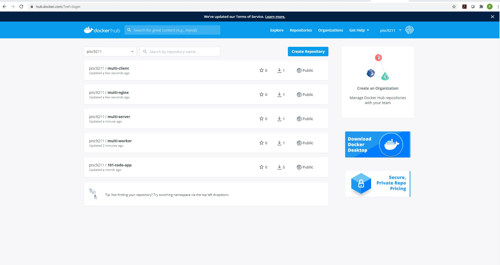

As you can see above, the four images created and pushed to dockerhub are:

- multi-client
- multi-nginx
- multi-server
- multi-worker

After creating these images, I created a couple services using AWS:

- Elastic Beanstalk
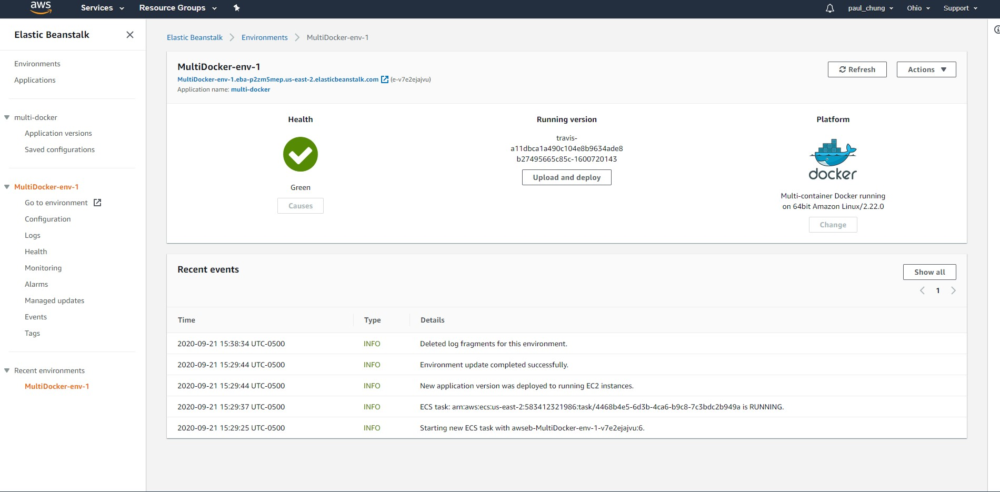

- ElastiCache (Redis)
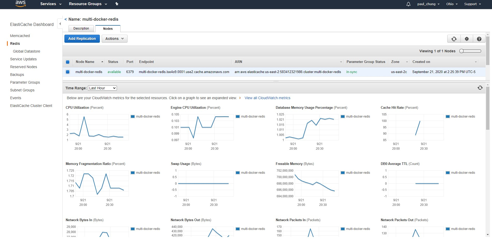

- RDS (Managed Relational Database Service)
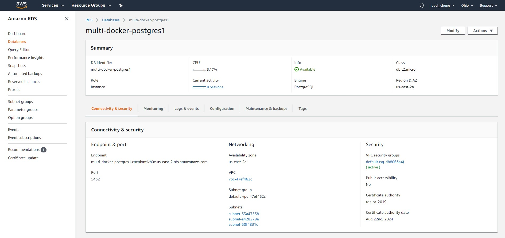

- VPC Security Group
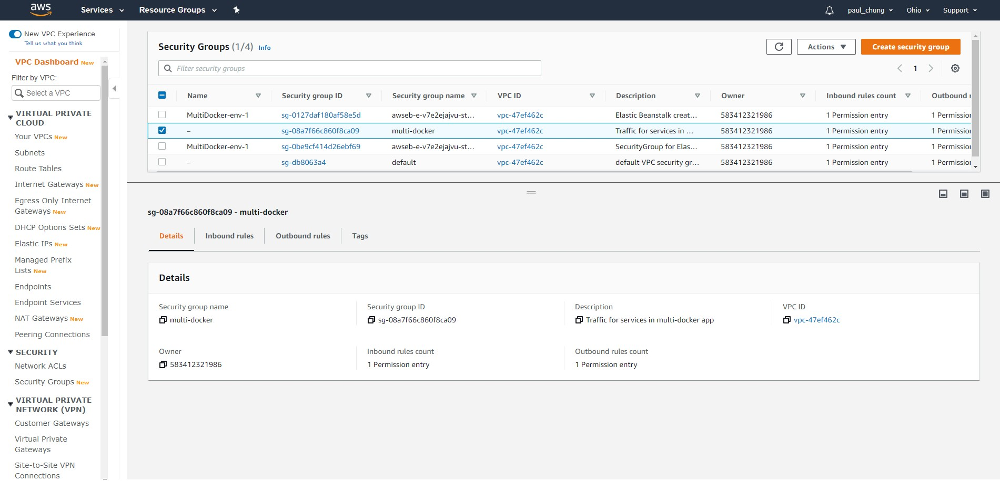

After creating the services using AWS, I then created this github repository and hooked it up with Travis-CI for CI/CD. The [*.travis.yml*](./.travis.yml) file contains the instructions for integrating and deploying the application.

I had instructed Travis-CI to integrate and deploy the application when I pushed the code to the master branch of the repo. After pushing, Travis built and deployed to AWS.
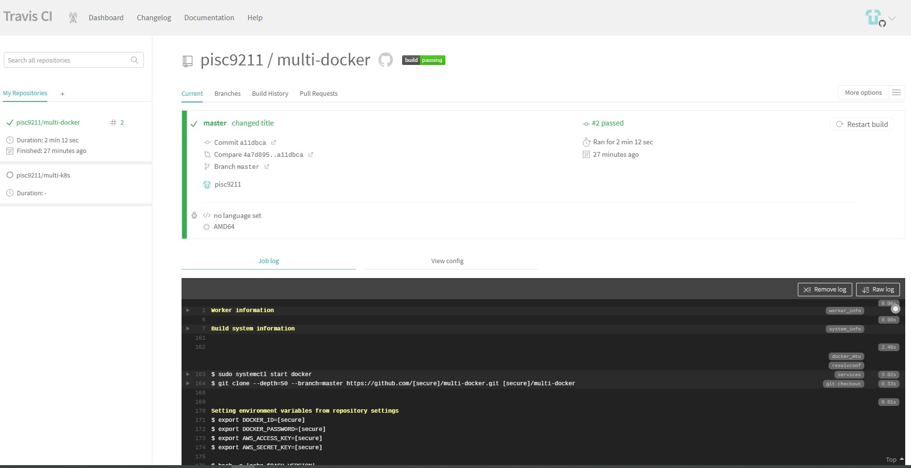

You can check out the Travis-CI log [here](./travis-log.txt).

Here is the deployed app:
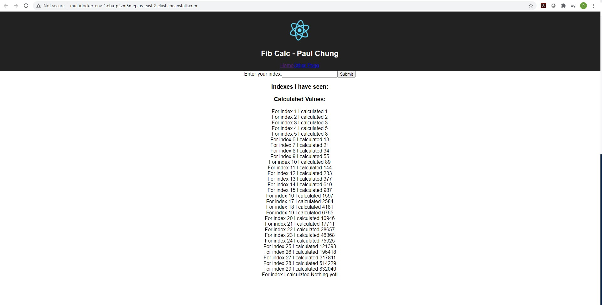

You can see the url which is `http://multidocker-env-1.eba-p2zm5mep.us-east-2.elasticbeanstalk.com/`. (This url will not work now because I took down all the services after completing the work processes/competencies since it would cost $$)

### Various cloud tools, services, platforms

You can see me use multiple tools, services, platforms like:

- GitHub
- Travis-CI
- Docker
- DockerHub
- AWS
  - Elastic Beanstalk
  - RDS
  - ElastiCache
  - Security Group

### Logging and Monitoring

[Here](./ec2-log.txt) is the last 100 lines of logging from my EC2 instance that I would use to help solve issues concerning my deployed services.

RDS Logging
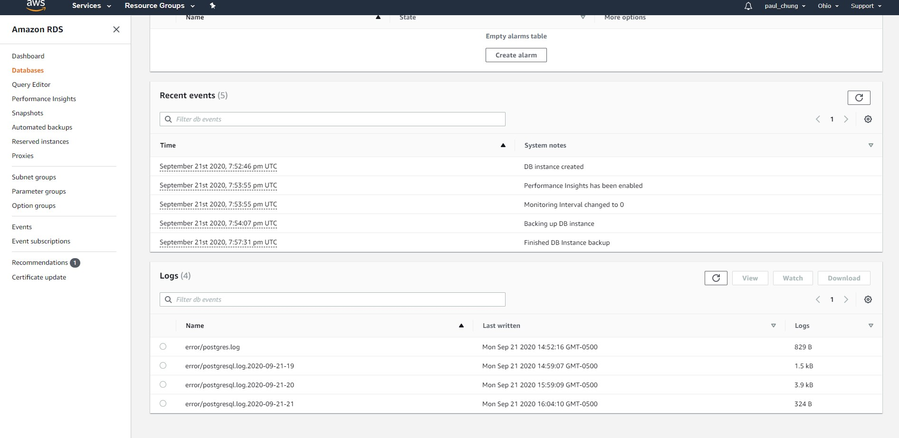

Elastic Beanstalk Monitoring
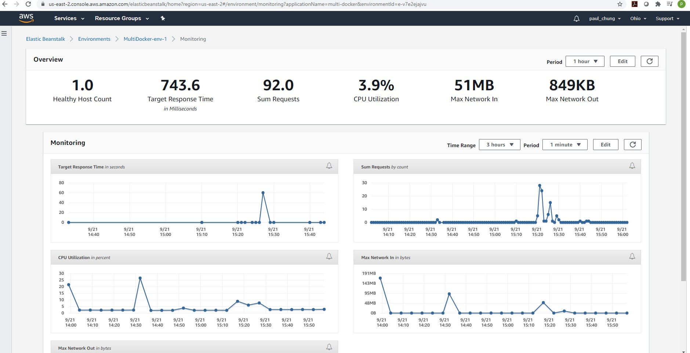

RDS Monitoring
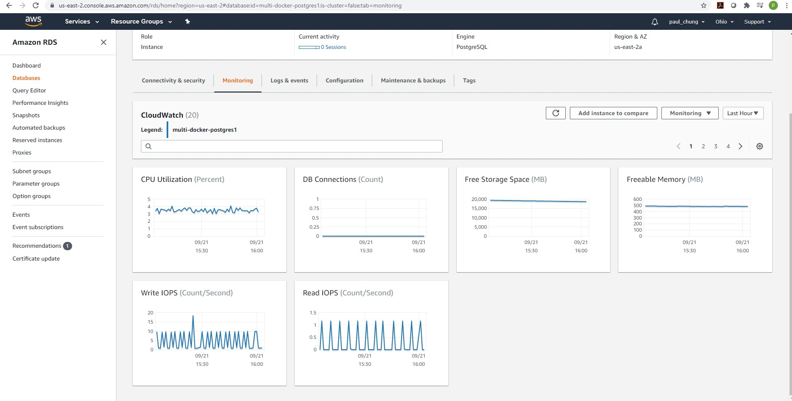

ElastiCache Metrics
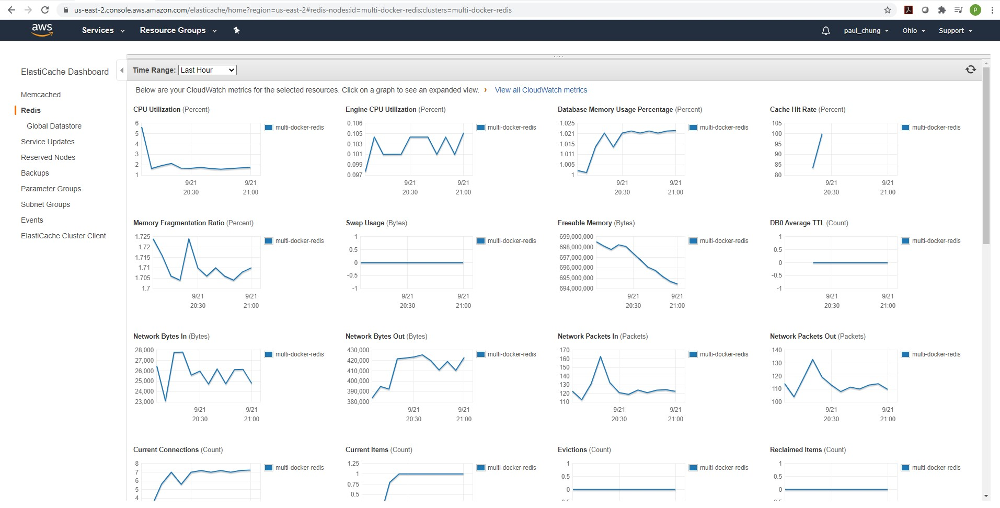

### On-premise to Cloud

You can see me moving the application from on-premise (my computer) to the cloud (AWS).
